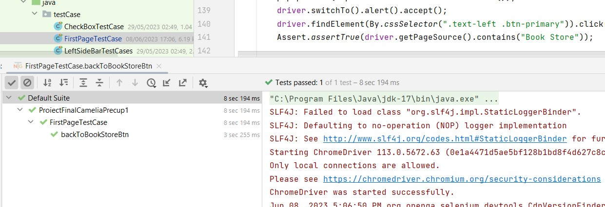

# ProiectFinalCameliaPrecup1
					
		                  DOCUMENTATIE  PROIECT  FINAL

***Nume Proiect si scop :****
ProiectFinalCameliaPrecup1 contine un numar de mai bine de 

30 teste automatizate folosind Selenium Webdriver ca si cadul de lucru(framework) 

 realizate pe  https://demoqa.com/books

***Creator Proiect*** : Camelia Precup pentru prezentare in data de 13.06.2023

Proiectul este creat utilizand POM, Page Orientated Model, cateva din avantajele 

folosirii acestuia fiind reducerea repetarii codului de test, astfel codul de test se poate 

reutiliza fiind si mai usor de intretinut .

Folosind  Selenium Webdriver aduce un plus prin consistenta si reutilizare a 

automatizarii testelor prin definirea de metode reutilizabile pentru interactiunea cu 

elementele de pe pagina.

Testele sunt rulate folosind TestNG care permite gruparea testelor in categorii sau 

suite care se pot rula in functie de necesitati si cerinte putandu-se atribui si prioritati 

testelor.

Fiecare test case deschide o instanta in Google Chrome iar dupa rularea fiecarui test 

acea instanta va fi inchisa. Pentru realizarea unei prezentari cat mai clare a acestui 

proiect, momentan inchiderea instantei este dezactivata.

Fisierul pom.xml contine dependintele Maven pentru intregul proiect  , fiesierele sursa, 

fisierele de configurare si alte resurse sunt organizate in directoare specifice , cum ar fi 

**src/main/java** si pentru codul sursa **src/test/java**.

Prin urmare ProiectFinalCameliaPrecup1 contine 2 pachete: pages si testCase

* pages contine locatorii din pagini

* testCase contine cazurile testate(test cases) pentru elemente din clasele pachetului de pages.

Validarile contin in principal happy flow dar pot fi si cazuri cu negative flow.

Suita de testare va aparea in tab-ul Run din Intellij si va arata in felul acesta.
 
**Exemplu:**

[]

